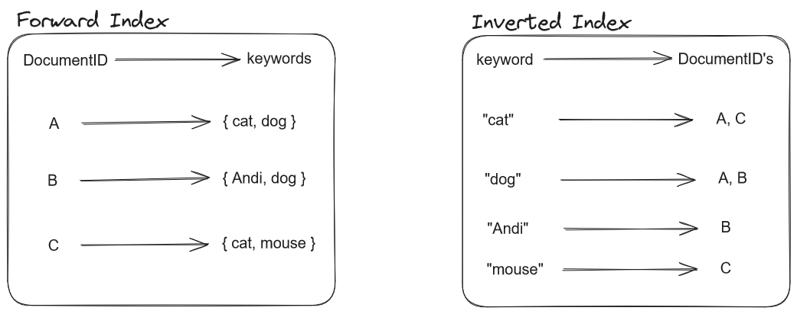
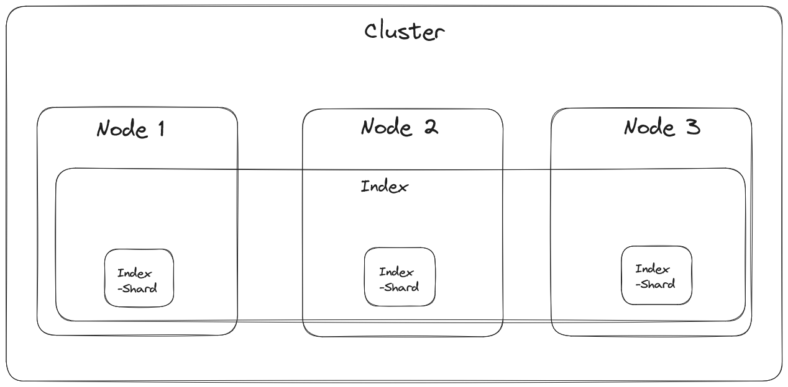

# Elasticsearch

Understanding Elasticsearch and its Full-Text Search capabilities: A Comprehensive Overview

_Author: [Benjamin Brünau](mailto:benjamin.bruenau@htwg-konstanz.de)_

## TL;DR

Elasticsearch, a distributed search and analytics engine, is a powerful tool for full-text search and data analysis. 
Built on Apache Lucene and written in Java, it has gained popularity for its flexibility, scalability, and ease of use. 
This article provides both a broad overview on the components and background of Elasticsearch but also a more in-depth view on the techniques employed for efficient text searching.

## Introduction

Elasticsearch, first introduced in 2010 by Shay Bannon which lead to the company Elastic, is a distributed search and analytics engine 
designed for handling large amounts of unstructured data. Primarily used for full-text search, it employs a combination of indexing and searching to deliver relevant results efficiently.
Elasticsearch is often used to provide a broader amount of search functionality on other database systems that do not provide a sophisticated way to do Full-Text search (the data is then usually synchronized between both systems).

## What is Elasticsearch?

### Overview

### Elasticsearch Components: The ELK Stack

Elasticsearch is often mentioned as part of the Elastic or ELK Stack.
The ELK Stack, consisting of Elasticsearch, Logstash, and Kibana, plays a crucial role in handling data. Elasticsearch is
responsible for the search and analytics part, Logstash for data processing and forwarding, and Kibana for visualizing
and managing stored data. Other services like Beats are often integrated for various functionalities, e.g. collection of data.

!!! example "Elastic Stack"
    
    Logstash is usually used to ingest data from various sources into Elasticsearch (optionally parsing it beforehand).
    Beats are Agents, attached to for example Applications to collect logs or other metrics. Kibana utilizes the powerful search engine of Elasticsearch to then visualize the data
    

### Licensing Controversies

Originally open source under the Apache License 2.0 with the promise to stay that way forever, Elasticsearch faced licensing changes in 2021 with the introduction
of the Server-Side Public License. This shift was driven by Elastic's [dissatisfaction](https://www.elastic.co/de/blog/why-license-change-aws) with Amazon offering Elasticsearch
as a service. In response, an open-source fork named OpenSearch emerged, supported by AWS, RedHat, SAP, and others.

!!! info "[Licensing Situation now](https://www.elastic.co/de/pricing/faq/licensing)"
    
    While no longer being open-source, Elasticsearch is still "source-available". Elasticsearch can still be used and modified at will.
    It is just not allowed to offer Elasticsearch as a Service (Software as a Service - SaaS) to potential customers, like Amazon did in the past on AWS. 

## Interlude: Full Text Search

With Full-Text Search the whole content of something is searched (e.g. a whole book) and not (only) its metadata (author, title, abstract). 
It is therefore all about searching unstructured data for example Tweets.
When searching for a specific query inside a document or a small set of documents the whole content can be scanned, this is usually done when using _STRG + F_ in the browser or editor of your choice,
but also by cli tools like `grep` on Unix systems.

Once the amount of documents becomes larger it gets increasingly less efficient to scan all the documents and their content.
The amount of effort and therefore time needed to search for a query is no longer sustainable.

To tackle this issue, Full-Text Search is usually split into two tasks.

1. **Indexing**: Scan text of all documents **once** and build a list of search terms.
2. **Searching**: A query will now search the index instead of the content of all documents.

In an abstract way this is also done when searching for a term in your browser, only that the documents are websites.
To understand and include context, semantics and relationships between words NLP techniques, like _ignoring stop words_ or _stemming_, are often used when indexing.
This is also done by Elasticsearch as you will see in the course of this article.

## How does Elasticsearch work ?

Elasticsearch processes often unstructured data, serializing it into JSON format and providing a REST API for search queries which are also in JSON format.
It is therefore a very flexible system which is accessible from a wide array of systems and programming languages.
When ingesting documents Elasticsearch also builds and updates an Index, in this case an **inverted** Index.

To make more clear why an inverted Index is used and why it is so efficient for Full-Text search I will explain the difference between a _Forward Index_ and an _Inverted Index_.

### Different Index Types & Elasticsearch's Inverted Index

A _Forward Index_ saves for each document the keywords it contains, mapping the ID of that Document to the keywords.
Queriying the Index would mean that the entry for each Document would need to be searched for the search term of the query.
An example for such an Index would be the list of contents of a book, when looking for something you would be able to jump to the chapter through the entry in the list but you would still need to search the whole chapter 
for the term you are looking for.

An _Inverted Index_ on the other hand maps the keyword onto the DocumentID's which contain that word, therefore it is only necessary to search the "keys" of the Index.
An example would be the Index at the end of the book, which lists all the pages where a keyword appears.

Generally a _Forward Index_ is fast when building the Index but slow when searching it, the _Inverted Index_ is rather slow when indexing documents but much faster when searching it.

!!! example "_Forward Index_ and _Inverted Index_"

    

The _Inverted Index_ utilized by Elasticsearch not only saves for each unique keyword in which documents it appears but also on which position inside the document.
Before building the Index an analysis process is run by an _analyzer_ on the input data for more accurate and flexible results when searching the Index and not only exact matches.
Indexing is done continuously, making documents available for searching directly after ingestion.

!!! info "Elasticsearch Field Types"

    All of the mentioned processes are only applied for indexing so called _full text_ fields of the saved JSON documents.
    Elasticsearch offers a wide variety of [field types](https://www.elastic.co/guide/en/elasticsearch/reference/current/mapping-types.html) next to common types like numbers, strings or dates.
    The type of a field is usually inferred dynamically by Elasticsearch but can also be specified explicitly through so called _Mappings_

### Text Analysis & Processing Techniques

To enhance full-text search, Elasticsearch employs [natural language processing techniques](/lectures/preprocessing/) during the analysis phase. 
Tokenization breaks strings into words, and normalization ensures consistent representation, handling variations like capitalization and synonyms.
Elasticsearch provides a couple of different built-in [_analyzers_](https://www.elastic.co/guide/en/elasticsearch/reference/8.12/analysis-overview.html) 
next to the commonly used _standard analyzer_, but also the possibility to create an own, _custom analyzer_

Text Analysis in Elasticsearch usually involves two steps: 

1. **Tokenization**: splitting up text into tokens and indexing each word 
2. **Normalization**: capitalization, synonyms and word stems are indexed as a single term

Tokenization enables the terms in a query string to be looked up individually, but not similar tokens (e.g. upper-and lowercase, word stems or synonyms) which makes a Normalization step necessary.
To make a query match to the analyzed and indexed keywords, the same analysis steps are applied to the string of the query.

While this makes it possible to fetch accurate results that match a search term, this could sometimes be hundreds of documents. It is cumbersome to search these results for 
the most relevant documents ourselves.
Elasticsearch applies similarity scoring on search results to solve this problem.

### Similarity Scoring

The default algorithm for Similarity Scoring is the BM25 algorithm, which is based on TF-IDF, determining the relevance of search results.
Similarity Scoring works on a per-field basis, it is therefore possible to apply a number of different algorithms for each document.

**TF-IDF** stands for _term frequency - inverse document frequency_ and is an algorithm to evaluate the relevance of a word in a document in relation to a collection of documents.

- **TF**: How often a specific word is found in a document (the higher the frequency the higher the relevance of the document)
- **IDF**: How rarely a specific word appears in a collection of documents (words that appear often are therefore less relevant)

In short **TF-IDF** is representing the weight of specific words and their relevance for each document but in relation to the whole collection of documents.

It still has a couple of shortcomings, for example the length of a document is not accounted for in the algorithm

Elasticsearch therefore utilizes the **BM25** algorithm which is based on **TF-IDF**. While the **IDF** part of the **BM25** algorithm is similar (rare words lead to a higher score), it also
addresses the length of a document: the score is lower for bigger documents (based on the amount of words that do not match the query).

### Scalability and Distribution

Elasticsearch's popularity stems from its scalability and distribution capabilities. Running on clusters, it automatically distributes data to nodes,
utilizing shards (each node gets a part of the inverted index, a shard) to enable parallel processing of search queries. This makes it well-suited for handling large datasets efficiently.

### Advanced Features and Use Cases - Vector Embeddings & Semantic Search

Elasticsearch also supports saving data in a vector representation (embeddings) through its _dense vector_ field type.
This is mostly used for k-nearest neighbor search, which returns the _k_ nearest neighbors of the vector representation of a query.
The embeddings can be generated before ingesting data into Elasticsearch or delegated to a NLP model inside of Elasticsearch which has to be added by the user
beforehand.

Elasticsearch also offers its own built-in, domain free **ELSER** model (Elastic Learned Sparse Encoder), which is a paid service that does not need to be trained on a customers data beforehand.

The storage of data as vector representations in Elasticsearch enables advanced searches, making it suitable for applications like recommendation engines and multimedia content searches.

## Key Takeaways

- Elasticsearch is a distributed search and analytics engine designed for full-text search and data analysis.
- The ELK Stack, comprising Elasticsearch, Logstash, and Kibana, is a powerful combination for managing and visualizing data.
- Licensing controversies led to the creation of OpenSearch, an open-source fork supported by AWS and other companies.
- Elasticsearch uses inverted indexes and the BM25 algorithm for efficient and relevant full-text search.
- Natural language processing techniques, such as tokenization and normalization, enhance the accuracy of search results.
- Elasticsearch's scalability and distribution capabilities make it suitable for handling large datasets and running on clusters.

## References

- [Elastic Search Licensing Change Announcement](https://www.elastic.co/de/blog/why-license-change-aws)
- [Elasticsearch Licensing](https://www.elastic.co/de/pricing/faq/licensing)
- [Elasticsearch Documentation](https://www.elastic.co/guide/en/elasticsearch/reference/8.12/index.html)
- [What is an Elasticsearch Index?](https://www.elastic.co/blog/what-is-an-elasticsearch-index)
- [k-nearest neighbor search in Elasticsearch](https://www.elastic.co/de/blog/introducing-approximate-nearest-neighbor-search-in-elasticsearch-8-0)
- [Image similarity search in Elasticsearch](https://www.elastic.co/de/blog/overview-image-similarity-search-in-elastic)
- [BM25 Algorithm 1](https://www.elastic.co/de/blog/practical-bm25-part-1-how-shards-affect-relevance-scoring-in-elasticsearch)
- [BM25 Algorithm 2](https://www.elastic.co/de/blog/practical-bm25-part-2-the-bm25-algorithm-and-its-variables)
- [OpenSearch Project](https://opensearch.org/)
- [Apache Lucene](https://lucene.apache.org/)